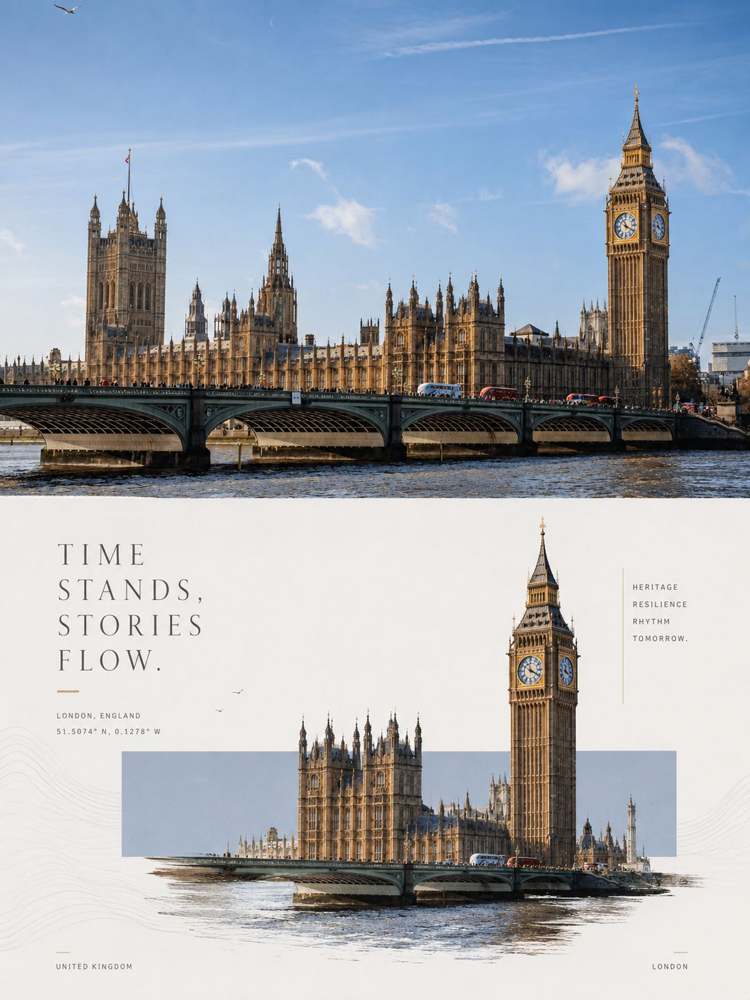

# Liminal Editorial Posters

A Codex skill for turning each uploaded photograph into an independent premium 3:4 editorial poster.

The top half preserves the source photograph. The bottom half reconstructs its defining subject or connected narrative ensemble through a restrained geometric threshold, frame-crossing photorealism, intentional negative space, and refined typography.

## Highlights

- One independent poster per source photo
- Exact 3:4 portrait canvas with a strict 50/50 split
- Faithful photographic preservation in the top panel
- Relationship-aware subject reconstruction in the bottom panel
- Adaptive horizontal, vertical, or diagonal geometric window
- Source-derived color, supporting marks, and editorial copy
- Output inspection with one targeted correction pass for hard failures

## Examples

Each source photograph becomes its own poster. These examples show how the same visual system adapts to different skylines, landmarks, colors, and spatial rhythms.

<table>
  <tr>
    <td align="center" width="50%">
      <br>
      <sub>San Francisco · Golden Gate Bridge</sub>
    </td>
    <td align="center" width="50%">
      <br>
      <sub>Shanghai · Pudong</sub>
    </td>
  </tr>
  <tr>
    <td align="center" width="50%">
      <br>
      <sub>Hong Kong · Victoria Harbour</sub>
    </td>
    <td align="center" width="50%">
      <br>
      <sub>London · Westminster</sub>
    </td>
  </tr>
</table>

## Install

Clone the repository into your Codex skills directory:

```bash
git clone https://github.com/iiArius/liminal-editorial-posters.git ~/.codex/skills/liminal-editorial-posters
```

Restart or reload Codex after installation if the skill is not discovered immediately.

## Use

Upload one or more photographs, then invoke:

```text
$liminal-editorial-posters
```

Each image is processed separately. The skill requires an available image-generation or image-editing tool for final raster output.

## Design language

The core idea is **Liminal Frame**: a real subject or connected visual story crosses a quiet, low-saturation geometric window between documentary photography and editorial abstraction.

The skill deliberately distinguishes a single focal story from a single isolated object. For example, a city scene may preserve a tower, skyline, bridge, and river as one narrative ensemble.

## Repository structure

```text
liminal-editorial-posters/
├── SKILL.md
├── README.md
├── agents/
│   └── openai.yaml
└── examples/
    ├── hong-kong-victoria-harbour.png
    ├── london-westminster.png
    ├── san-francisco-golden-gate.png
    └── shanghai-pudong.png
```

## 中文简介

该 Skill 会把每张上传照片分别制作成一张独立的 3:4 高级编辑海报：上半部严格保留原始摄影，下半部提取主体或完整叙事组合，通过低饱和几何窗口、越界关系、东方留白与克制排版完成视觉重构。
