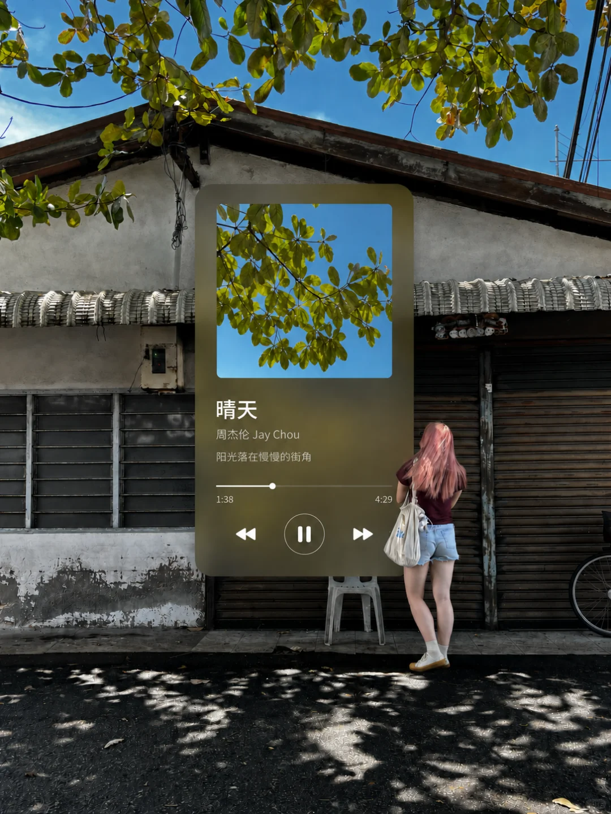
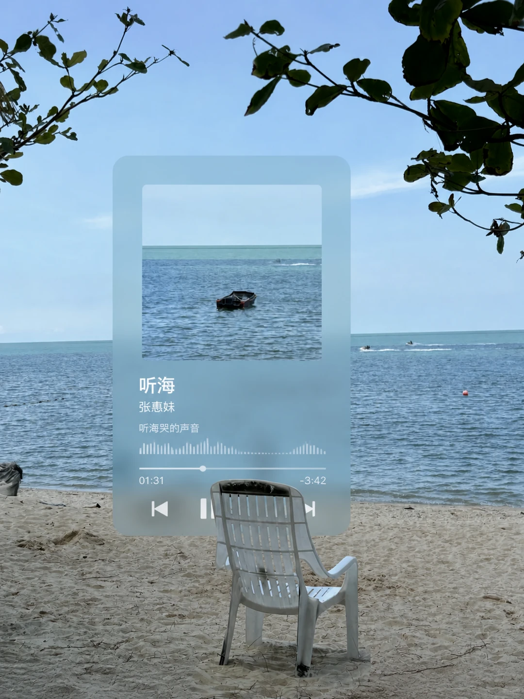
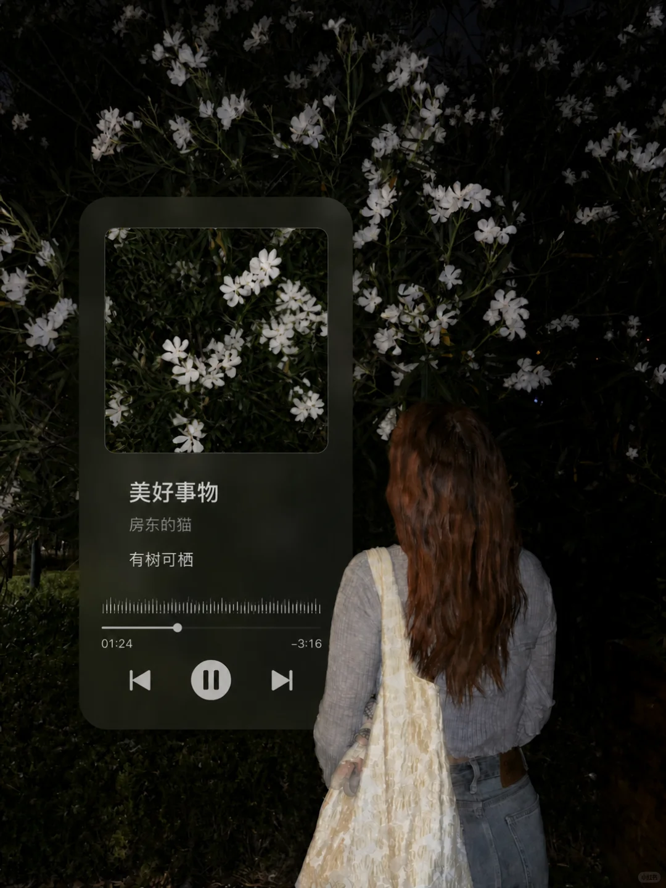

# Photo Now Playing

把日常照片变成一张正在播放歌曲的音乐记忆卡片。

这个 Codex skill 会根据照片的场景、光线和情绪匹配歌曲与短歌词，并加入专辑封面、磨砂玻璃播放器和自然的前景层次。

## 案例

<table>
  <tr>
    <td></td>
    <td></td>
  </tr>
  <tr>
    <td></td>
    <td></td>
  </tr>
</table>

## 使用

上传一张照片，然后说：

```text
做成音乐卡片
```

也可以指定歌曲或语言：

```text
用《晴天》做成音乐卡片
```

```text
做成英文歌的音乐卡片
```

## 安装

让 Codex 从 GitHub 安装：

```text
请从 https://github.com/carolinaaafy/photo-now-playing 安装这个 skill
```
